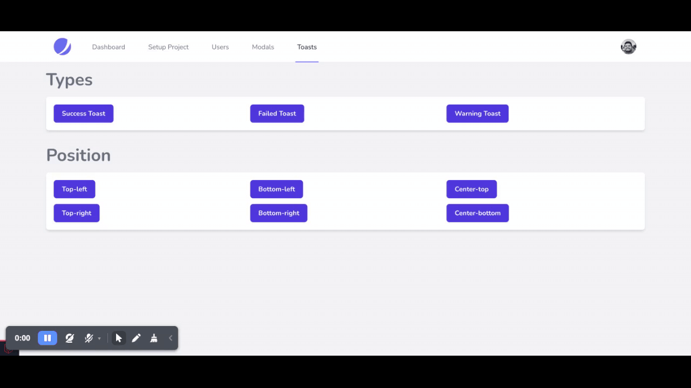

# Toast-message component
This component give you html with tailwind classes when you need to show toast-message to your project.


You just need to copy below tag and paste at place you want to show toast-message,

```html
<x-toast />
```

## Livewire allows you to fire browser window events like so,
```php
$this->dispatchBrowserEvent('notify', [
    'message' => 'Yuppie, Data saved.',
    'type' => 'success',
    'position' => 'top-right'
]);
```

To learn more for events in laravel-livewire go to ([Reference])(https://laravel-livewire.com/docs/2.x/events)

# Demo 


Go to [Documentation](../README.md)